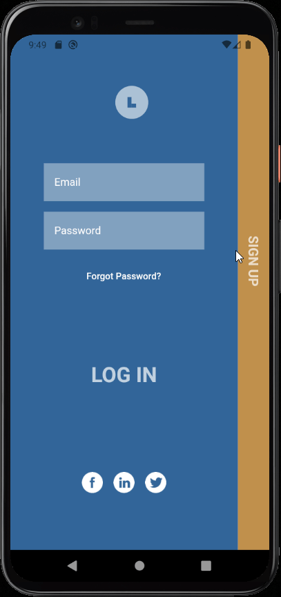

# Eduance

This is an educational app created by Kiran Vishwak and Gokul Eswaran for the national level Hackathon TekSpark'21 on 27/10/2021 hosted by Karpagam Institute of Technology, Coimbatore.

## Objective

The idea is to develop a one-stop app for new programmers to learn coding for free without much difficulty.
The application has sophisticated roadmaps to help guide new programmers in choosing their paths and guide their learning. The application enables users to access the best curated online tutorials, coding questions, and projects. The application has an interactive UI for ease of access. Users can resume their ongoing course.  

## Features

- Added Youtube Player IFrame flutter plugin for playing or streaming YouTube videos inline using the official iFrame Player API.

- Integrated Dialogflow chatbot which has natural language processing and it scrapes data from webpages.

## Documentation

[Flutter](https://flutter.dev/docs)

[Firebase](https://firebase.google.com/docs)

[DialogFlow](https://cloud.google.com/dialogflow/docs)

[Youtube Player IFrame](https://pub.dev/packages/youtube_player_iframe)

## Tech Stack

**Front End:**  Dart, Flutter
**Back End:** Firebase
**Database:** Firestore
**Authentication** FireAuth
**Technologies:** DialogFlow, Google Cloud

## Authors

- [@Vishwak-Kiran](https://github.com/Vishwak-Kiran)
- [@GokZ465](https://github.com/GokZ465)
